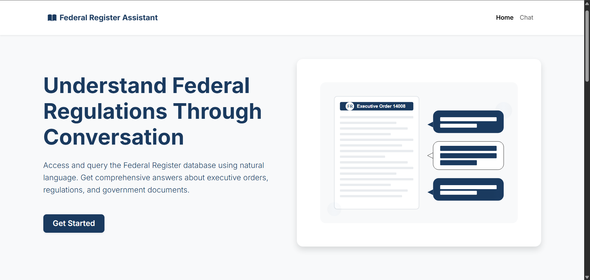
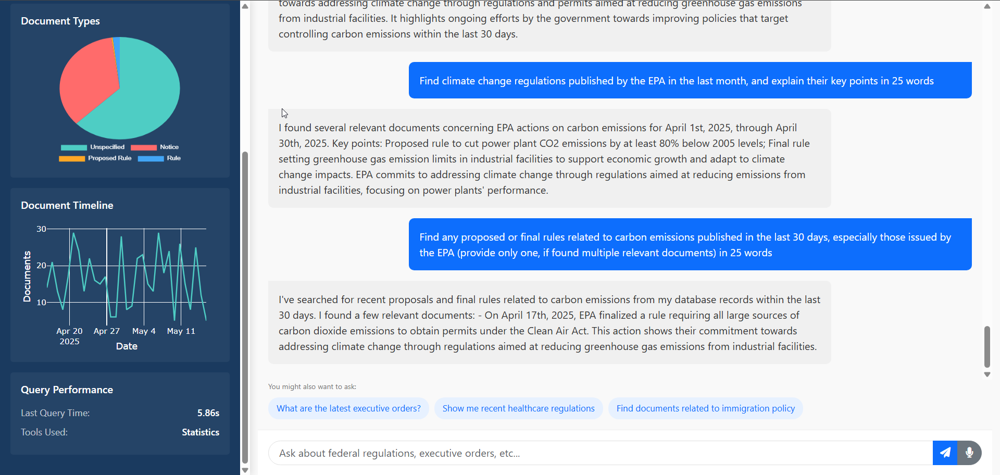

# Federal Register Assistant



## Overview
A user-facing RAG (Retrieval Augmented Generation) agentic system that provides insights into federal government documents. This system retrieves up-to-date information from the Federal Register API, stores it in a MySQL database, and allows users to query it through a chat interface.

## Features

- **Daily Data Updates**: Automated pipeline fetches the latest Federal Register documents
- **Interactive Chat Interface**: User-friendly interface to ask queries about federal regulations
- **Powerful Query Capabilities**: Search by keywords, document type, date ranges, and more
- **Intelligent Response Generation**: Uses Qwen2.5 LLM to generate natural language responses
- **Data Visualizations**: Interactive charts showing document distributions and trends
- **Document Preview**: View document snippets with highlighted keywords
- **Follow-up Suggestions**: Smart suggestions for related queries

## Simple Architecture Overview

```
┌─────────────┐     ┌──────────────┐     ┌─────────────┐      ┌──────────────┐
│ Data        │     │ MySQL        │     │ Agent with  │      │ User         │
│ Pipeline    │────▶ Database     │────▶  Tool Calls  │◀───▶ Interface     |
└─────────────┘     └──────────────┘     └─────────────┘      └──────────────┘
   (Daily)             (Storage)           (Inference)          (Frontend)
```

## Screenshots

### 1. Simple Query Execution


### 2. Complex Query Execution


### 3. Edge-case Query Execution


## Demo & Documentation

- 📄 [Project Documentation](https://drive.google.com/file/d/1pCJqXYNwmjf_M8AzgZVVBfuDXAy-b_96/view)
- 🎥 [Video Preview](https://drive.google.com/file/d/1BT3HQmu9WyP9d8--m9W_SwtyuJU-quHr/view)

## Setup

### Prerequisites

- Python 3.10+
- MySQL Server
- Ollama (for local LLM)

### Installation

1. Clone this repository
   ```
   git clone https://github.com/Prathameshv07/federal-register-agent.git
   cd federal-register-agent
   ```

2. Install dependencies
   ```
   pip install -r requirements.txt
   ```

3. Set up the database
   ```
   Get-Content .\federal-schema.sql | mysql -u root -p  # PowerSell

   cmd /c "mysql -u root -p < federal-schema.sql"  # Command Prompt
   ```

4. Configure environment variables
   Create a `.env` file in the root directory with the following variables:
   ```
   MYSQL_HOST=localhost
   MYSQL_PORT=3306
   MYSQL_USER=your_username
   MYSQL_PASSWORD=your_password
   MYSQL_DATABASE=federal_register
   OLLAMA_URL=http://localhost:11434
   ```

5. Download Ollama and the Qwen model
   ```
   # Install Ollama from https://ollama.ai/
   ollama pull qwen2.5:1.5b-instruct-q4_K_M
   ```

### Running the System

1. Start the data pipeline to fetch the latest data
   ```
   python pipeline/main.py
   ```

2. Start the API server
   ```
   uvicorn api.main:app --reload
   ```

3. Open `http://localhost:8000` in your browser

## Usage

1. Type your query in the chat interface
2. The system will search the federal register database for relevant documents
3. Results will be formatted into a natural language response
4. You can view visualizations and document previews in the interface

### Sample Queries

- "What are the latest executive orders?"
- "Show me regulations about climate change from this year"
- "Find healthcare-related documents published last week"
- "Summarize recent presidential documents"

## Architecture

- **Data Pipeline**: Asynchronous pipeline for fetching and processing Federal Register data
- **Database**: MySQL with optimized schema for efficient document retrieval
- **Agent**: LLM-powered agent with tool-calling capabilities
- **API**: FastAPI backend with WebSocket support for real-time chat
- **Frontend**: Interactive web interface for querying and visualization